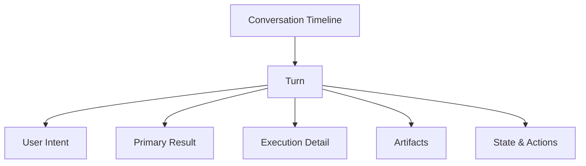

# DeepSeekX 聊天结果区展示模型设计

> 日期：2026-05-29
> 状态：Implemented
> 主题：统一 Chat / Agent 结果展示模型

---

## 1. 背景

当前 DeepSeekX 的聊天窗口已经不再只是“用户一条消息，助手一条回复”的简单结构。

随着 Agent Loop、工具调用、审批流、文件改动、检索结果和 MCP 执行的接入，结果区实际承载的内容已经扩展为多种不同类型的数据：

- 用户输入
- 助手最终答复
- thinking / reasoning
- agent steps
- 文件 diff 与预览
- 执行状态
- 审批动作
- 工具结果摘要

但当前 UI 仍然主要以“消息气泡 + 调试面板”的方式呈现这些数据，导致几个明显问题：

- 重要信息和调试信息混在一起
- `agent_steps` 信息密度高，但层次感弱
- 文件改动、工具结果、检索结果没有被产品化为独立展示类型
- 普通 Chat 和 Agent 模式在结果区缺少统一展示心智
- 审批卡、状态卡、最终答复之间的主次关系不够清晰

因此，需要定义一份“聊天结果区展示模型设计”，把结果区从“消息列表”升级为“任务回合结果视图”。

---

## 2. 目标

本方案目标是为 DeepSeekX 设计一套统一的聊天结果展示模型，使其能够：

1. 同时支持普通 Chat 和 Agent 模式
2. 明确区分“最终答案”“执行细节”“变更结果”“状态与审批”
3. 能稳定承接未来更多工具类型，而不需要每加一种工具就临时堆 UI
4. 让普通用户优先看到结果，让高级用户可以逐层展开过程
5. 为后续的搜索结果卡片、MCP 结果卡片、日志卡片等扩展预留结构

---

## 3. 非目标

本方案第一版不解决以下问题：

- 富文本编辑器级别的 Markdown 全量支持
- 图片、视频、音频、表格等复杂富媒体渲染
- 多列工作台式布局
- 跨对话汇总视图
- 可视化流程图或可拖拽的步骤编排 UI
- 完整的日志查看器

第一版重点是：先把聊天窗口结果区的**信息架构、数据模型和组件边界**设计正确。

---

## 4. 核心结论

聊天窗口不应再被视为单纯的消息流，而应被视为：

```text
Conversation Timeline
  -> Turn
    -> User Intent
    -> Primary Result
    -> Execution Detail
    -> Artifacts
    -> State & Actions
```

也就是说，**一个回合（Turn）是顶层单位**，每个回合内部再承载不同类型的结果卡片。

---

## 5. 展示数据类型

### 5.1 结果区的 8 类核心数据

正常的 LLM 聊天窗口，在 DeepSeekX 这个产品语境下，至少应支持以下 8 类数据：

1. 用户输入
2. 最终自然语言答复
3. 思考 / 推理过程
4. Agent 执行步骤
5. 文件 / 代码变更结果
6. 审批 / 风险确认
7. 工具 / 检索 / 外部数据结果
8. 状态型消息

### 5.2 五类一级展示容器

为了让 UI 层次清晰，这 8 类数据应收敛进 5 个一级展示容器：

1. `User Intent`
2. `Primary Result`
3. `Execution Detail`
4. `Artifacts`
5. `State & Actions`

这五类不是具体数据字段，而是**产品展示层级**。

---

## 6. 信息架构

### 6.1 顶层结构



### 6.2 每个容器承载的内容

#### `User Intent`

用于展示这个回合“用户到底请求了什么”。

包含：

- `turn.user_input`
- 本次请求显式附加的 `/skill`
- 本次请求显式附加的 `/mcp`
- 未来可扩展的 `@文件路径` 附件

#### `Primary Result`

用于展示“用户最关心的输出结果”，默认应该始终可见。

包含：

- 最终自然语言答复
- 研究结论摘要
- 代码说明摘要
- 建议 / 决策型结果

#### `Execution Detail`

用于展示“系统是怎么得到这个结果的”，默认应半折叠。

包含：

- `thinking_steps`
- `agent_steps`
- tool call / tool result 摘要
- 阶段性计划与 observation

#### `Artifacts`

用于展示“可视化产物或结构化结果”。

包含：

- code block
- before / after preview
- diff preview
- file operations
- changed ranges
- 未来的 citation / search result cards

#### `State & Actions`

用于展示“当前回合的状态”以及用户可触发的后续动作。

包含：

- running / done / blocked / failed / needs_confirmation
- 审批提示
- approve / reject / retry
- 未来的 continue / stop / inspect log

---

## 7. 与当前数据结构的映射

当前 `src/types.ts` 已经具备一部分基础结构。

### 7.1 已有结构

当前已有：

- `Turn`
- `thinking_steps`
- `final_response`
- `agent_goal_status`
- `agent_steps`
- `AgentStep.preview_type`
- `before_preview`
- `after_preview`
- `diff_preview`
- `changed_ranges`
- `file_operations`

对应定义见：[types.ts](/Users/Gress/code/ai/deepseekX/src/types.ts:114)

### 7.2 当前映射关系

建议映射如下：

| 展示容器 | 当前数据来源 |
|---|---|
| `User Intent` | `turn.user_input` |
| `Primary Result` | `turn.final_response` |
| `Execution Detail` | `turn.thinking_steps`, `turn.agent_steps` |
| `Artifacts` | `before_preview`, `after_preview`, `diff_preview`, `file_operations`, `changed_ranges` |
| `State & Actions` | `turn.agent_goal_status`, `step.requires_confirmation` |

### 7.3 当前缺口

当前结构中仍缺少几个明确字段：

- `request_attachments`
  - skill attachments
  - mcp attachments
  - file references
- `result_cards`
  - 用于把最终结果从纯文本提升为更结构化卡片
- `tool_results`
  - 用于承接非文件类工具结果，而不是全部压缩进 `result_summary`
- `turn_status_detail`
  - 比如耗时、错误阶段、是否已重试、重试次数

---

## 8. 组件设计

### 8.1 顶层组件关系

建议将当前结果区拆成如下结构：

```text
MessageList
  -> TurnList
    -> TurnItem
      -> UserIntentCard
      -> ResultCardGroup
      -> ExecutionPanel
      -> ArtifactPanel
      -> StatusPanel
```

### 8.2 组件职责

#### `TurnItem`

职责：

- 作为一个回合的根容器
- 控制各展示区块的折叠 / 展开
- 组织主次顺序

它不应继续直接渲染全部细节，而应把渲染委派给子组件。

#### `UserIntentCard`

职责：

- 渲染用户气泡
- 展示本次请求携带的附件

#### `ResultCardGroup`

职责：

- 承接 `final_response`
- 后续可以把结果按类型拆为：
  - AnswerCard
  - ResearchCard
  - RecommendationCard

#### `ExecutionPanel`

职责：

- 承接 `thinking_steps`
- 承接 `agent_steps`
- 显示步骤级状态、输入摘要、结果摘要

#### `ArtifactPanel`

职责：

- 渲染 diff、代码块、文件操作、preview
- 把“结果内容”和“执行日志”分开

#### `StatusPanel`

职责：

- 渲染 turn 级状态
- 渲染审批提示与 follow-up 按钮
- 呈现错误、阻塞、成功等全局状态

---

## 9. 卡片类型设计

建议在展示层标准化以下 8 种卡片类型：

### 9.1 `AnswerCard`

场景：

- 最终自然语言答复
- 一般性总结

数据来源：

- `turn.final_response`

### 9.2 `ResearchCard`

场景：

- 搜索结果摘要
- 调研结论
- 引用来源

当前状态：

- 暂无专门结构，后续应从工具结果中抽出

### 9.3 `ExecutionCard`

场景：

- 某个 agent step 的输入 / 结果 / 状态

数据来源：

- `AgentStep`

### 9.4 `ReasoningCard`

场景：

- 思考过程
- 规划过程

数据来源：

- `ThinkingStep`

### 9.5 `CodeArtifactCard`

场景：

- 代码块
- 文件内容预览
- before / after 内容

### 9.6 `DiffCard`

场景：

- 补丁
- diff
- changed ranges
- file operations

### 9.7 `ApprovalCard`

场景：

- 风险说明
- 需要确认的动作
- approve / reject / retry

### 9.8 `StatusCard`

场景：

- running
- blocked
- failed
- done
- warning

---

## 10. 视觉层级建议

### 10.1 默认展开策略

默认应展开：

- `User Intent`
- `Primary Result`
- `State & Actions`

默认应折叠或半折叠：

- `Execution Detail`
- `Artifacts`

### 10.2 主次原则

必须遵循：

- 最终结果优先于执行过程
- 回合状态优先于步骤日志
- 审批动作优先于调试细节
- 变更产物优先于原始控制台式摘要

### 10.3 错误展示原则

错误不应只呈现为一条红色日志。

应该拆成两层：

- `Turn-level error summary`
- `Step-level failure details`

例如：

```text
当前回合失败：Planner 输出无效
失败阶段：agent_plan
详细原因：retrieve_context.intent 不是合法枚举值
可执行动作：重试 / 查看原始输出 / 复制诊断
```

---

## 11. 状态流设计

建议把回合状态统一抽象为：

```text
idle -> running -> done
               -> blocked
               -> failed
               -> needs_confirmation
```

并支持补充属性：

- `error_stage`
- `retry_count`
- `started_at`
- `finished_at`
- `duration_ms`

这样 UI 才能稳定显示：

- 正在执行
- 阻塞于哪一步
- 一共跑了多久
- 是第一次失败还是重试后失败

---

## 12. 与当前实现的差距

当前实现已经完成了基础渲染，但仍存在以下问题：

### 12.1 `TurnItem` 职责过重

[TurnItem.tsx](/Users/Gress/code/ai/deepseekX/src/components/TurnItem.tsx:11) 同时负责：

- 用户消息
- thinking 展示
- agent steps
- 审批流
- 最终回复
- loading
- markdown

这会导致后续每增加一种结果类型，就继续向单组件堆逻辑。

### 12.2 `final_response` 仍是单一文本

当前 `Primary Result` 还没有结构化分类，研究结果、建议结果、错误结果、总结结果都被塞在同一文本块中。

### 12.3 工具结果没有独立展示类型

当前很多工具结果被压缩在：

- `AgentStep.result_summary`
- `AgentStep.summary`

里，缺乏单独的结果卡片。

### 12.4 Message 路径和 Turn 路径仍然并存

[MessageList.tsx](/Users/Gress/code/ai/deepseekX/src/components/MessageList.tsx:24) 仍保留了旧 `messages` 渲染路径与新 `turns` 渲染路径双轨并行，这会让样式系统长期分裂。

---

## 13. 推荐实施顺序

### Phase A：先做结构拆分

- [x] 拆出 `UserIntentCard`
- [x] 拆出 `ExecutionPanel`
- [x] 拆出 `StatusPanel`
- [x] 拆出 `ArtifactPanel`
- [x] 保持现有数据结构不变，只调整组件边界

### Phase B：再做结果类型产品化

- [x] 为 `final_response` 增加结果类型判断
- [x] 把研究类、建议类、错误类结果拆成不同视觉卡片
- [x] 为 `AgentStep` 增加按 action 类型的样式区分

### Phase C：补齐结构化数据

- [x] 为 Turn 增加 `request_attachments`
- [x] 为 Turn 增加 `duration_ms`
- [x] 为 Turn 增加 `error_stage`
- [x] 为工具结果增加结构化 `tool_results`

### Phase D：统一 Message / Turn 渲染

- [x] 逐步淘汰旧 `messages` 回退路径
- [x] 让聊天窗口统一基于 `Turn` 渲染

---

## 14. 验收标准

聊天结果区改造完成后，应满足以下标准：

1. 用户一眼能分清“我的请求”“最终答案”“执行过程”“当前状态”。
2. 文件变更结果不再埋在日志中，而是可独立查看。
3. 审批提示不会和普通步骤卡片混成一体。
4. Chat 与 Agent 两种模式共享同一套结果展示骨架。
5. 后续新增搜索结果卡片、MCP 结果卡片时，不需要再重做顶层结构。

---

## 15. 结论

DeepSeekX 的聊天窗口结果区，不应继续被设计成“增强版消息气泡列表”，而应被设计成：

- 以 `Turn` 为顶层单位
- 以 `Primary Result` 为主视觉焦点
- 以 `Execution Detail` 和 `Artifacts` 为辅助展开层
- 以 `State & Actions` 负责状态与交互闭环

从产品角度看，这套方案的本质是：

- 把“聊天”升级为“任务结果展示”
- 把“日志”升级为“结构化执行视图”
- 把“错误提示”升级为“可操作状态卡”

这会是 DeepSeekX 从一个“有 Agent 能力的聊天界面”走向“真正的任务型 Agent 工作台”的基础一步。
